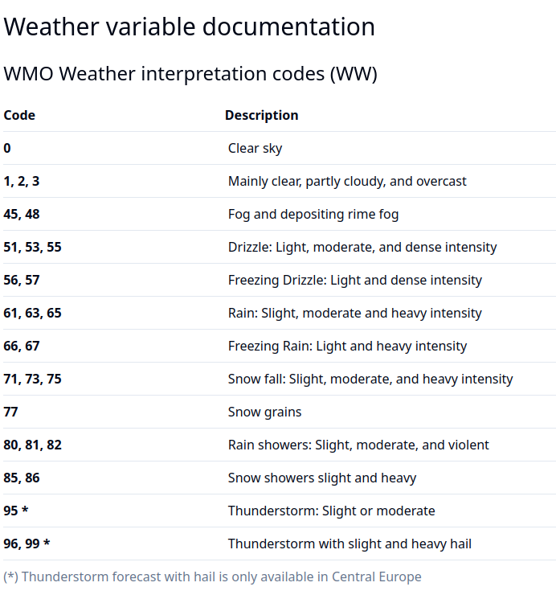

# Weather Setup

Very Basic weather "app" that shows the current weather condition of your location or the location set through Clay settings.

This code has 2 main parts. The C side, and the JS side. The JS side handles the Open-meteo Communication, while the C side just displays it on the display.

## C Part

### request_weather_update() 
Calls the JS script to immediately get the current weather

### weather_condition_reference(int condition)
Takes in an integer of the weather code returned by open_meteo(see below) and returns the relevant string.

### load_settings()/save_settings()
Used to save the current condition to avoid re-calling the JS side when the app is closed/opened 

### prv_select_click_handler/prv_click_config_provider
Sets up the select button to request a weatherupdate

### prv_inbox_received_handler
Handles the communication between the JS and C sides. 
Mainly just reads the current weather condition and writes it to the variable

### prv_window_load/prv_window_unload/prv_init/prv_deinit/main
The usual stuff

## JS Part

### fetchWeatherForLocation/getReverseGeocodingAndFetchWeather/getLocationAndFetchWeather/getCoordinatesForCityAndFetchWeather

Self explanatory

### sendDataToPebble
Requires the messages keys and data you want to send to the pebble

### getWeatherData
The most important part to worry about, as it's making the call to Open-Meteo. 
Change the url in line 128 to the relevant API call from Open-Meteo, and sample the data as needed within the response section of the code(lines 136-172)

## Weather Code reference 

